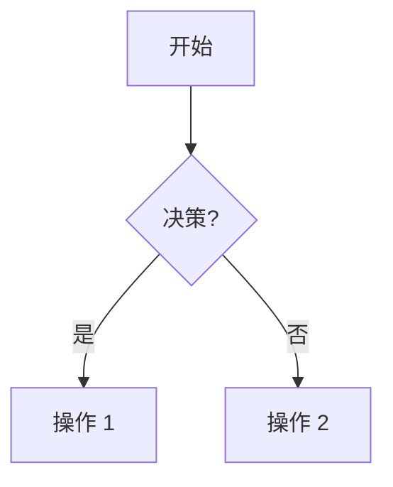

---
# Story 元数据 - 必需
title: "{Story 标题占位符 - 例如：实现邮箱用户登录}"
id: "{StoryID 占位符 - 例如：UA002，最好来自 Jira/追踪系统}"
target_version: "{目标版本占位符 - 例如：v1.0, Sprint 24}"
status: "草稿" # 状态选项：草稿, 已批准, 进行中, 已阻塞, 已完成
owner: "{工程师名称占位符 或 'AI 助手' (如果由 AI 起草)}"
story_points: "{数值占位符 或 TBD (待定)}" # 例如：3, 5, 8
jira_id: "" # 由开发人员手动关联，也可能呢没有
created_date: "YYYY-MM-DD" # 创建日期
last_updated: "YYYY-MM-DD" # 最后更新日期
# 可选元数据:
# reviewers: ["工程师B", "测试负责人"]
# depends_on: ["UA001"] # 依赖的其他 Story ID
# blocks: ["OM005"] # 阻塞的其他 Story ID
# related_prd_feature: "../../index.md" # 指向父特性 PRD 索引的相对链接
# related_design: "../../design-considerations.md" # 指向特性设计文档的相对链接
---

## 1. 用户故事描述 (User Story Description)
**作为一个** {角色：例如：注册用户、系统管理员、应用访客}
**我想要** {行动/目标：例如：使用我的邮箱和密码登录}
**以便于** {收益/价值：例如：我可以访问我的个性化仪表盘}

## 2. 验收标准 (Acceptance Criteria - AC)
列出具体的、可衡量的、可实现的、相关的、有时间限制的标准。
每个 AC 都应该是可以独立测试的。
格式：- [ ] AC 描述 (在实现和测试后勾选)
- [ ] AC 1: {清晰、可测试的验收标准，例如：用户可以成功输入邮箱和密码}
- [ ] AC 2: {例如：当输入无效邮箱格式时，应用应显示明确的错误提示}
- [ ] AC 3: {例如：登录成功后，用户应被导航到主屏幕}
- [ ] ...

## 3. 背景与上下文 (Context & Background)
提供理解此故事所必需的背景信息。
- 为什么这个故事很重要？ (如果适用，链接到业务驱动因素)
- 相关功能的当前状态如何？
- 是否做出了任何假设？
- 以往相关故事或决策的相关历史。

## 4. 技术设计与实现计划 (Technical Design & Implementation Plan)
本节概述实现此故事的计划。
AI 可以根据故事描述和 AC 协助起草此部分。
工程师的审查和细化至关重要。

### 4.1. 提议的解决方案/方法 (Proposed Solution / Approach)
简要描述实现此故事的技术方法。例如：采用 MVVM 模式，使用 Retrofit 进行网络请求，Room 进行本地存储。

### 4.2. 关键组件/模块影响 (Key Android Components / Modules Affected)
列出将要创建或修改的主要 Android 组件 (Activity, Fragment, Composable, ViewModel, Service, Repository) 或代码模块。
- Activity/Fragment/Composable:
- ViewModel:
- Repository:
- Util/Helper 类:
- 模块 (如果多模块):

### 4.3. 数据模型/模式变更 (如有) (Data Models / Schema Changes (if any))
- 描述任何新的或修改的数据库表模式 (Room Entity)、API 请求/响应模型 (DTOs)、或 Kotlin 数据类。
- 链接或嵌入模式定义。
```kotlin
// Room Entity 示例
data class LoginRequest(val email: String, val pass: String)
data class UserToken(val token: String, val userId: String)
```

### 4.4. API 考量 (如有) (API Considerations (if any))
新的API端点、对现有端点的更改、请求/响应示例、错误处理。 
- **端点**: `POST /auth/login`
- **请求体**: `LoginRequest`
- **成功响应**: `UserToken`
- **错误码**: 400 (无效输入), 401 (认证失败)

### 4.5. UI/UX 考量 (如有) (UI/UX Considerations (if any))
- 涉及的关键 UI 元素 (例如：登录按钮、输入框、错误提示 TextView/Snackbar)。
- 指向 Figma/Sketch 模型或线框图的链接。
- 重要的用户交互流程 (例如：输入错误时的反馈、加载状态的显示)。
- 无障碍性 (Accessibility) 注意事项。

### 4.6. 权限需求 (如有) (Permission Requirements (if any))
列出此 Story 需要的 Android 权限，以及请求和处理逻辑。
- 例如: `android.permission.INTERNET` (用于网络请求)

### 4.7. 后台任务/异步处理 (如有) (Background Tasks / Asynchronous Processing (if any))
描述此 Story 是否涉及后台任务 (如 WorkManager, Service, Coroutines on IO dispatcher) 及其处理方式。

### 4.8. 潜在风险与缓解 (Potential Risks & Mitigation)
在此 Story 实现过程中识别的技术风险及应对策略。 

## 5. 任务 (TDD 聚焦) (Tasks (TDD Focused))
将故事分解为可操作的开发任务。
遵循 TDD：先测试，后实现。
使用 - [ ] 表示待办, - [x] 表示已完成, ~~任务~~ 表示跳过/取消。
AI 可以根据 AC 和技术设计协助建议任务。

### 5.1. 任务组: ViewModel 与业务逻辑
1.  **编写测试 (Write Tests)**:
    - [ ] 测试用例: 验证 ViewModel 在成功登录时的状态更新
    - [ ] 测试用例: 验证 ViewModel 在登录失败时的错误状态处理
    - [ ] 测试用例: 验证输入数据校验逻辑 (如果 ViewModel 负责)
2.  **实现 (Implement)**:
    - [ ] Subtask: 创建/修改 `LoginViewModel.kt`
    - [ ] Subtask: 实现登录 UseCase/Repository 的调用逻辑
    - [ ] Subtask: 实现输入校验
3.  **重构与评审 (Refactor & Review)**:
    - [ ] 重构 ViewModel 代码
    - [ ] ViewModel 逻辑代码评审

### 5.2. 任务组: UI 实现 (Activity/Fragment/Composable)
1.  **编写测试 (Write Tests)**:
    - [ ] UI 测试用例 (Espresso/Compose): 验证登录表单元素的显示和基本交互
    - [ ] UI 测试用例: 验证点击登录按钮后，加载状态的正确显示
    - [ ] UI 测试用例: 验证登录成功/失败后 UI 的正确反馈
2.  **实现 (Implement)**:
    - [ ] Subtask: 开发/修改 `LoginActivity.kt` 或 `LoginScreen.kt` (Compose) 布局和UI元素
    - [ ] Subtask: 实现 UI 与 ViewModel 的数据绑定和事件交互
    - [ ] Subtask: 实现加载指示器和错误提示的 UI 逻辑
3.  **重构与评审 (Refactor & Review)**:
    - [ ] 重构 UI 代码
    - [ ] UI/UX 评审

### 5.3. 任务组: 数据层与网络 (如适用)
1.  **编写测试 (Write Tests)**:
    - [ ] 测试用例: (Repository/DataSource) 模拟 API 成功响应并验证数据映射
    - [ ] 测试用例: (Repository/DataSource) 模拟 API 失败响应并验证错误处理
2.  **实现 (Implement)**:
    - [ ] Subtask: (如需) 修改/创建相关的 Repository 或 DataSource 实现
    - [ ] Subtask: (如需) 定义 Retrofit 接口或网络请求逻辑
3.  **重构与评审 (Refactor & Review)**:
    - [ ] 重构数据层代码
    - [ ] 数据层代码评审

### 5.4. 任务组: 集成与端到端测试 (Integration & E2E Testing)
1.  **编写测试 (Write Tests)**:
    - [ ] 集成测试用例: 验证从 UI 输入到 ViewModel 到 Repository 的完整数据流 (不mock网络)
    - [ ] 端到端测试场景: 模拟用户完整登录流程
2.  **实现/运行 (Implement/Run)**:
    - [ ] 执行集成测试。
    - [ ] 执行端到端测试。

### 5.5. 任务组: 文档更新 (Documentation Updates)
- [ ] 更新相关的特性 PRD: `{{ self.related_prd_feature | default: 'N/A' }}`
- [ ] 更新相关的特性设计文档: `{{ self.related_design | default: 'N/A' }}`
- [ ] 添加/更新代码注释 (KDoc)。

## 6. 约束与依赖关系 (Constraints & Dependencies)
- 列出影响此故事的技术、业务或资源约束。
- 列出此故事依赖的其他故事、团队或外部服务。

- **约束 (Constraints)**:
- **依赖关系 (Dependencies)**:

## 7. 图表 (可选) (Diagrams (Optional))
嵌入针对此故事复杂逻辑、流程或组件交互的 Mermaid 图。


## 8. 开发笔记与日志 (Development Notes & Log)
开发过程中的运行记录。
- 发现的重要考量点。
- 做出的技术决策及其原因。
- 代码片段、配置或使用的命令。
- 遇到的问题及解决方法。
- 此部分对 AI 的“记忆”和团队其他开发者至关重要。

- YYYY-MM-DD HH:MM - 工程师/AI: 为此故事初始化项目结构。
- ...

## 9. AI 交互日志 (Chat Command Log - AI Interaction Record)
记录与 AI 助手就此故事进行的关键交互。
- 用户的提示/命令。
- AI 的重要问题及用户的回答。
这有助于追踪 AI 如何贡献以及其输出的上下文。

- 用户: "AI，你能为用户登录功能起草一下 API 端点的结构吗？"
- AI: "好的，关于用户登录端点，我们是使用 JWT (令牌) 进行认证吗？除了邮箱和密码，请求体中还需要哪些字段？"
    - 用户: "是的，用 JWT。请求体目前只需要邮箱和密码。"
- ...